# Bank SulutGo ServiceDesk API Data Flow Documentation

## Table of Contents
1. [Overview](#overview)
2. [API Architecture](#api-architecture)
3. [Authentication & Authorization Flow](#authentication--authorization-flow)
4. [Core API Categories](#core-api-categories)
5. [API Endpoints Reference](#api-endpoints-reference)
6. [Data Flow Diagrams](#data-flow-diagrams)
7. [Error Handling & Response Patterns](#error-handling--response-patterns)
8. [Security & Rate Limiting](#security--rate-limiting)
9. [Integration Patterns](#integration-patterns)

## Overview

The Bank SulutGo ServiceDesk API provides a comprehensive RESTful interface for IT service management, following ITIL v4 principles. The API is built on Next.js 15 App Router with TypeScript, utilizing Prisma ORM for database operations and NextAuth.js for authentication.

### Key Technologies
- **Framework**: Next.js 15 (App Router)
- **Runtime**: Node.js with TypeScript
- **Database**: PostgreSQL with Prisma ORM
- **Authentication**: NextAuth.js v5 (Beta)
- **Validation**: Zod schema validation
- **Security**: JWT tokens, API keys, role-based access control
- **Real-time**: Socket.io (configured but not fully implemented)

### API Base URL
- **Development**: `http://localhost:3000/api`
- **Production**: `https://servicedesk.banksulutgo.co.id/api`

## API Architecture

### Request Processing Pipeline

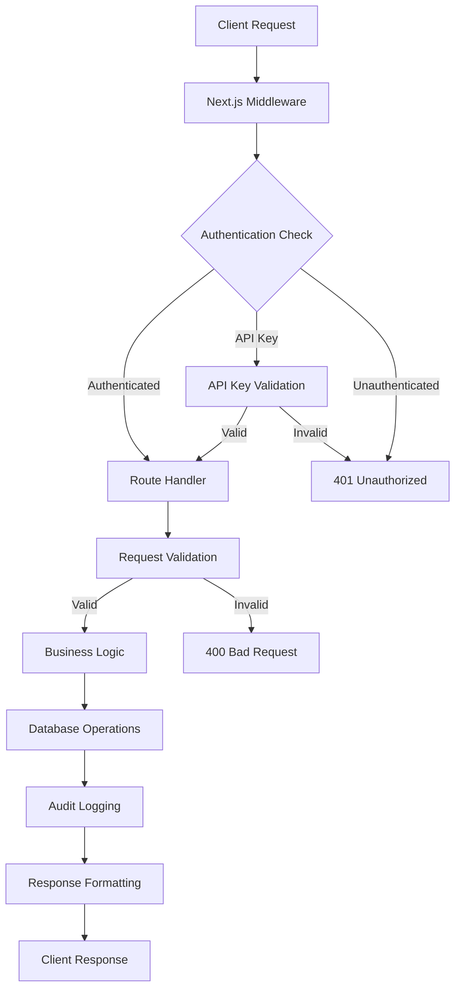

### Data Flow Layers

1. **Presentation Layer**: HTTP endpoints receiving requests
2. **Authentication Layer**: NextAuth.js session validation or API key authentication
3. **Validation Layer**: Zod schema validation for request payloads
4. **Business Logic Layer**: Core application logic and rules
5. **Data Access Layer**: Prisma ORM database operations
6. **Audit Layer**: Activity and change logging
7. **Response Layer**: Standardized response formatting

## Authentication & Authorization Flow

### 1. Session-Based Authentication (NextAuth.js)

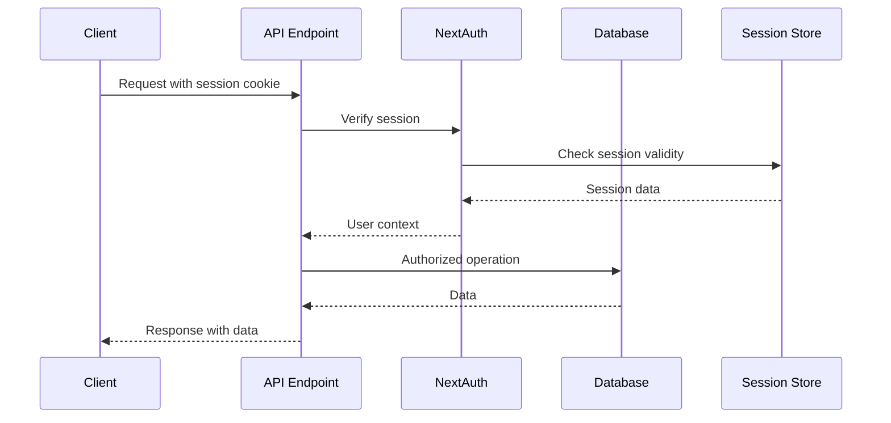

**Implementation Details:**
- Session stored in JWT tokens or database
- Automatic session refresh on activity
- Account lockout after 5 failed attempts (30-minute duration)
- Role-based access control (RBAC)

### 2. API Key Authentication

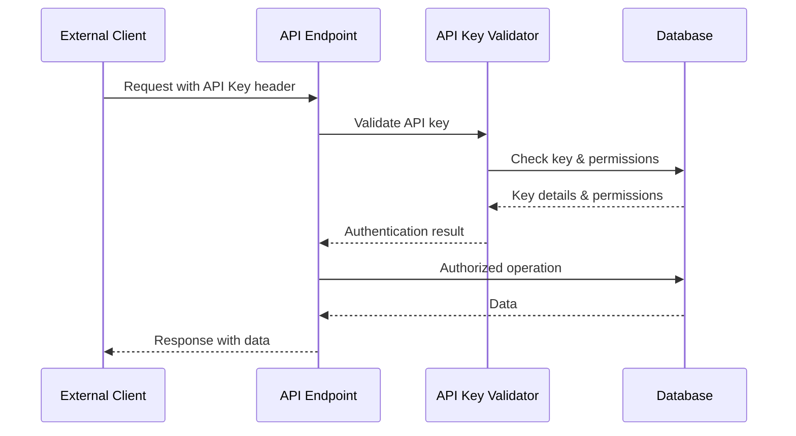

**API Key Features:**
- Scoped permissions (READ, WRITE, DELETE, ADMIN)
- Service-specific access (TICKET_STATUS, ATM_CLAIMS, etc.)
- Rate limiting per key
- Expiration dates
- Usage tracking

### Authentication Endpoints

#### POST /api/auth/[...nextauth]
NextAuth.js dynamic route handling all authentication operations.

**Supported Operations:**
- `signin`: User login with credentials
- `signout`: Session termination
- `session`: Get current session
- `csrf`: CSRF token for forms

#### POST /api/auth/change-password
Change user password with current password verification.

**Request:**
```json
{
  "currentPassword": "string",
  "newPassword": "string"
}
```

**Response:**
```json
{
  "success": true,
  "message": "Password changed successfully"
}
```

#### POST /api/auth/forgot-password
Initiate password reset process.

**Request:**
```json
{
  "email": "user@example.com"
}
```

**Response:**
```json
{
  "success": true,
  "message": "Reset instructions sent to email"
}
```

## Core API Categories

### 1. Ticket Management APIs (`/api/tickets/*`)

The ticket system is the core of the ServiceDesk, managing IT incidents, service requests, and changes.

#### Ticket Lifecycle Flow

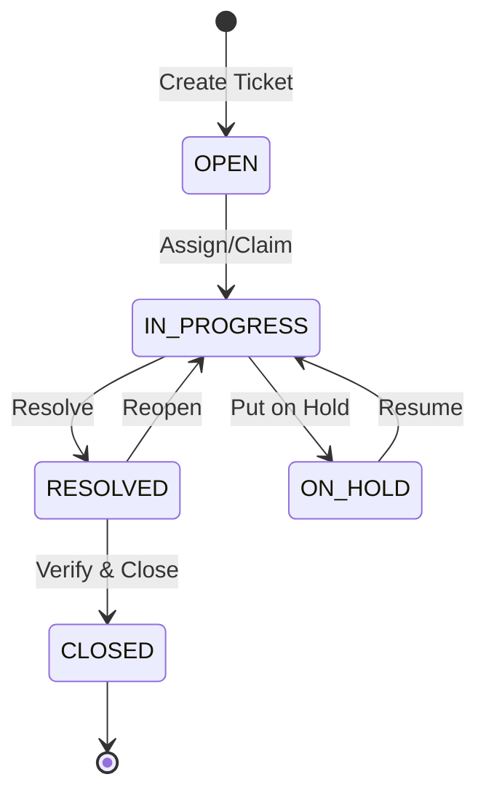

#### Core Ticket Endpoints

##### GET /api/tickets
List tickets with filtering, pagination, and role-based visibility.

**Query Parameters:**
- `status`: Comma-separated status values (OPEN, IN_PROGRESS, RESOLVED, CLOSED)
- `priority`: Comma-separated priorities (LOW, MEDIUM, HIGH, URGENT, CRITICAL)
- `assignedTo`: Filter by assigned technician ID
- `branchId`: Filter by branch
- `categoryId`: Filter by service category
- `page`: Page number (default: 1)
- `limit`: Items per page (max: 200, default: 10)
- `search`: Search in title/description
- `sortBy`: Sort field (createdAt, priority, status, etc.)
- `sortOrder`: asc or desc
- `includeConfidential`: Include confidential tickets (requires permission)
- `slaStatus`: Filter by SLA status (within, at_risk, breached)

**Response:**
```json
{
  "success": true,
  "data": {
    "tickets": [
      {
        "id": "string",
        "ticketNumber": "string",
        "title": "string",
        "description": "string",
        "status": "OPEN",
        "priority": "MEDIUM",
        "category": "INCIDENT",
        "createdAt": "2024-01-01T00:00:00Z",
        "updatedAt": "2024-01-01T00:00:00Z",
        "createdBy": { "id": "string", "name": "string" },
        "assignedTo": { "id": "string", "name": "string" },
        "branch": { "id": "string", "name": "string" },
        "service": { "id": "string", "name": "string" },
        "slaStatus": "within",
        "responseTime": 120,
        "resolutionTime": null
      }
    ],
    "pagination": {
      "page": 1,
      "limit": 10,
      "total": 100,
      "totalPages": 10
    },
    "stats": {
      "open": 25,
      "inProgress": 30,
      "resolved": 20,
      "closed": 25
    }
  }
}
```

##### POST /api/tickets
Create a new ticket with automatic SLA calculation and notifications.

**Request Body:**
```json
{
  "title": "string",
  "description": "string",
  "serviceId": "string",
  "priority": "MEDIUM",
  "category": "INCIDENT",
  "issueClassification": "SYSTEM_ERROR",
  "categoryId": "string",
  "subcategoryId": "string",
  "itemId": "string",
  "branchId": "string",
  "fieldValues": [
    {
      "fieldId": "string",
      "value": "string"
    }
  ],
  "attachments": [
    {
      "filename": "string",
      "mimeType": "string",
      "size": 1024,
      "content": "base64_encoded_content"
    }
  ],
  "isConfidential": false,
  "securityClassification": "MEDIUM"
}
```

**Data Flow:**
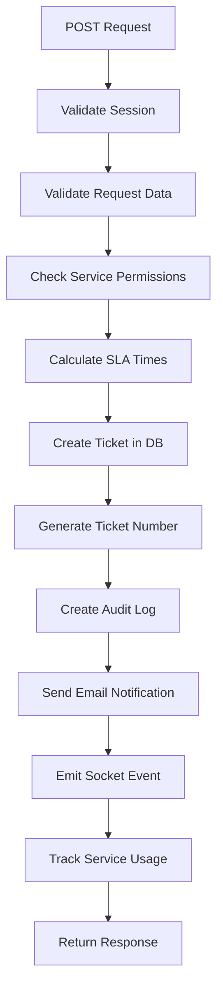

##### PUT /api/tickets/[id]/status
Update ticket status with validation and workflow rules.

**Request Body:**
```json
{
  "status": "IN_PROGRESS",
  "comment": "Starting work on this issue"
}
```

**Business Rules:**
- Only assigned technician or admin can change status
- Status transitions must follow workflow rules
- Resolution requires resolution comment
- Closure requires manager approval for high priority tickets

##### POST /api/tickets/[id]/assign
Assign ticket to a technician.

**Request Body:**
```json
{
  "technicianId": "string",
  "reassignmentReason": "string"
}
```

##### POST /api/tickets/bulk/assign
Bulk assign multiple tickets.

**Request Body:**
```json
{
  "ticketIds": ["id1", "id2", "id3"],
  "technicianId": "string"
}
```

### 2. Admin Management APIs (`/api/admin/*`)

Administrative endpoints for system configuration and management.

#### User Management

##### GET /api/admin/users
List all users with filtering options.

**Query Parameters:**
- `search`: Search by name, email, or phone
- `role`: Filter by role (comma-separated)
- `branchId`: Filter by branch
- `supportGroupId`: Filter by support group
- `status`: active or inactive

##### POST /api/admin/users
Create new user account.

**Request Body:**
```json
{
  "username": "string",
  "name": "string",
  "email": "user@example.com",
  "password": "string",
  "role": "USER",
  "branchId": "string",
  "supportGroupId": "string",
  "phone": "string"
}
```

**Validation:**
- Username must be unique
- Email must be valid and unique
- Password must meet strength requirements
- Branch must exist and be active
- Support group assignment based on role

#### Service Catalog Management

##### POST /api/admin/services
Create or update service definition.

**Request Body:**
```json
{
  "name": "string",
  "code": "string",
  "description": "string",
  "tier1CategoryId": "string",
  "tier2CategoryId": "string",
  "tier3CategoryId": "string",
  "supportGroupId": "string",
  "priority": "MEDIUM",
  "slaResponseHours": 4,
  "slaResolutionHours": 24,
  "requiresApproval": false,
  "approvalLevels": 1,
  "isActive": true,
  "fieldTemplates": [
    {
      "label": "string",
      "name": "string",
      "type": "text",
      "required": true,
      "options": []
    }
  ]
}
```

#### Import Operations

##### POST /api/admin/import
Bulk import data from CSV files.

**Request Body:**
```json
{
  "type": "services",
  "csvContent": "base64_encoded_csv",
  "options": {
    "skipValidation": false,
    "updateExisting": true,
    "dryRun": false
  }
}
```

**Import Types:**
- services: Service catalog
- users: User accounts
- branches: Branch definitions
- categories: Service categories

**Import Flow:**
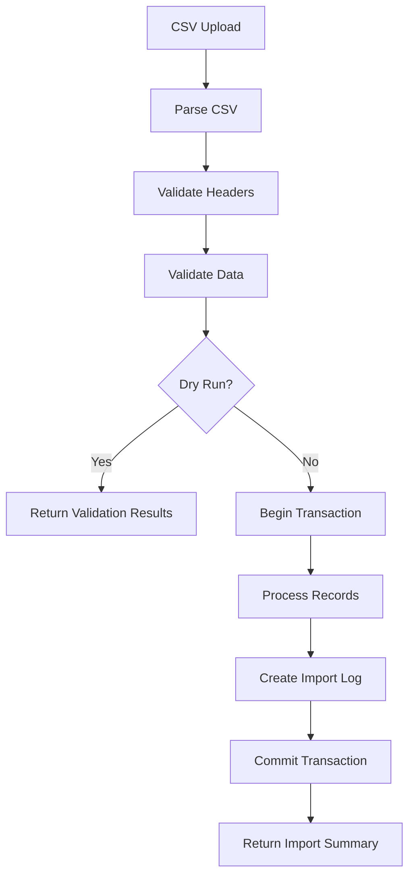

### 3. Monitoring APIs (`/api/monitoring/*`)

Real-time monitoring for network infrastructure and ATMs.

#### Network Monitoring

##### GET /api/monitoring/network/status
Get current network status for all monitored entities.

**Response:**
```json
{
  "success": true,
  "data": {
    "branches": [
      {
        "id": "string",
        "name": "string",
        "status": "ONLINE",
        "lastPing": "2024-01-01T00:00:00Z",
        "responseTime": 25,
        "mediaType": "VSAT"
      }
    ],
    "atms": [
      {
        "id": "string",
        "terminalId": "string",
        "status": "ONLINE",
        "lastPing": "2024-01-01T00:00:00Z",
        "responseTime": 30,
        "location": "string"
      }
    ],
    "summary": {
      "totalBranches": 80,
      "onlineBranches": 75,
      "totalATMs": 150,
      "onlineATMs": 140,
      "averageResponseTime": 28
    }
  }
}
```

##### POST /api/monitoring/branches/ping
Trigger manual ping test for branches.

**Request Body:**
```json
{
  "branchIds": ["id1", "id2"],
  "timeout": 5000
}
```

#### ATM Monitoring

##### GET /api/monitoring/atms/status
Get ATM operational status.

**Query Parameters:**
- `status`: Filter by status (ONLINE, OFFLINE, MAINTENANCE)
- `branchId`: Filter by branch
- `includeMetrics`: Include performance metrics

##### POST /api/monitoring/atms/incidents
Report ATM incident.

**Request Body:**
```json
{
  "atmId": "string",
  "incidentType": "HARDWARE_FAILURE",
  "description": "string",
  "severity": "HIGH",
  "autoCreateTicket": true
}
```

### 4. Report Generation APIs (`/api/reports/*`)

Comprehensive reporting endpoints for different user roles and domains.

#### Report Categories

##### Admin Reports (`/api/reports/admin/*`)
- Service catalog analysis
- SLA performance metrics
- User activity analytics
- System utilization

##### Manager Reports (`/api/reports/manager/*`)
- Branch operation summaries
- Team performance metrics
- Approval workflow status
- Resource allocation

##### Technician Reports (`/api/reports/technician/*`)
- Personal performance dashboard
- Task execution metrics
- Technical issue trends
- Workload distribution

##### Infrastructure Reports (`/api/reports/infrastructure/*`)
- ATM intelligence dashboard
- Network performance trends
- Incident analysis
- Capacity planning

#### Report Generation Flow

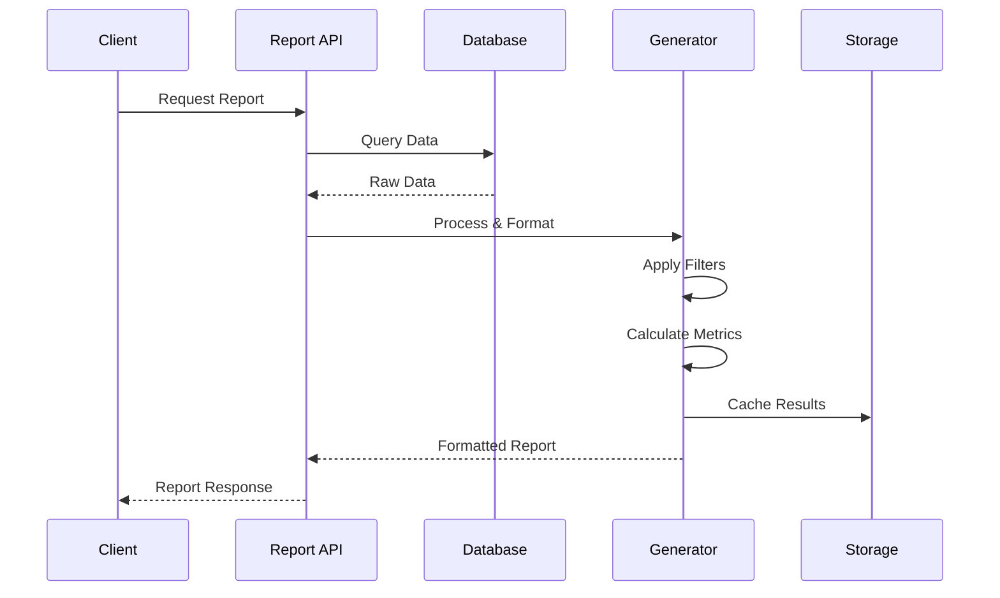

##### GET /api/reports/tickets/all-tickets
Generate comprehensive ticket report.

**Query Parameters:**
- `startDate`: Report start date
- `endDate`: Report end date
- `format`: json, csv, or pdf
- `groupBy`: category, status, priority, branch
- `includeDetails`: Include ticket details

**Response:**
```json
{
  "success": true,
  "data": {
    "summary": {
      "totalTickets": 1000,
      "openTickets": 200,
      "avgResolutionTime": 12.5,
      "slaCompliance": 92.3
    },
    "breakdown": {
      "byStatus": { /* status counts */ },
      "byPriority": { /* priority counts */ },
      "byCategory": { /* category counts */ }
    },
    "trends": [
      {
        "date": "2024-01-01",
        "created": 45,
        "resolved": 40,
        "closed": 35
      }
    ],
    "tickets": [ /* detailed ticket list */ ]
  }
}
```

### 5. Public APIs (`/api/public/*`)

External-facing endpoints for third-party integrations.

#### ATM Claim Submission

##### POST /api/public/claims
Submit ATM transaction claims via API key.

**Headers:**
```
X-API-Key: your-api-key-here
Content-Type: application/json
```

**Request Body:**
```json
{
  "claimType": "REIMBURSEMENT",
  "claimAmount": 1000000,
  "claimCurrency": "IDR",
  "claimDate": "2024-01-01T00:00:00Z",
  "claimReason": "ATM dispensed incorrect amount",
  "claimantName": "John Doe",
  "claimantEmail": "john@example.com",
  "claimantPhone": "08123456789",
  "claimantBranchCode": "001",
  "referenceNumber": "TRX123456",
  "attachments": [
    {
      "filename": "receipt.pdf",
      "mimeType": "application/pdf",
      "size": 102400,
      "content": "base64_encoded_content"
    }
  ]
}
```

**Response:**
```json
{
  "success": true,
  "data": {
    "ticketNumber": "TKT-2024-00001",
    "status": "OPEN",
    "priority": "HIGH",
    "estimatedResolution": "2024-01-03T00:00:00Z"
  }
}
```

### 6. Integration APIs (`/api/omnichannel/*`)

Multi-channel integration endpoints.

##### POST /api/omnichannel/webhooks/slack
Slack integration webhook.

**Request Body:**
```json
{
  "event": "ticket.created",
  "data": {
    "ticketNumber": "string",
    "title": "string",
    "priority": "HIGH",
    "url": "string"
  }
}
```

## Data Flow Diagrams

### 1. Ticket Creation Flow

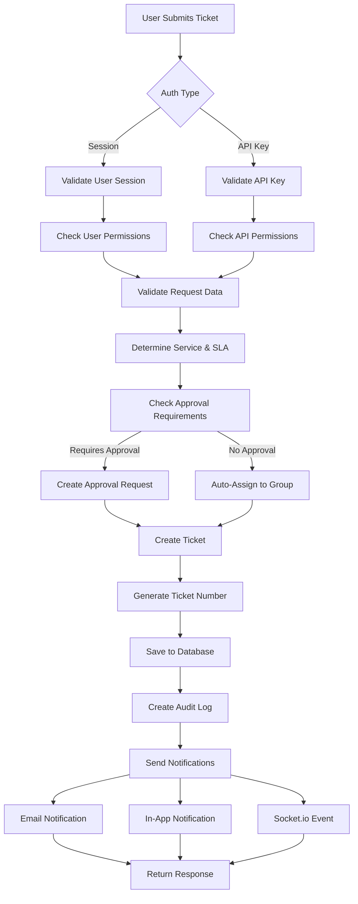

### 2. Authentication & Authorization Flow

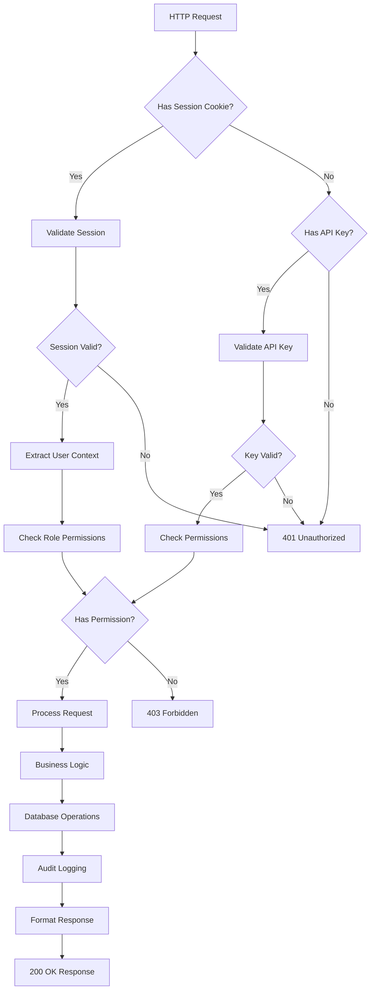

### 3. Report Generation Flow

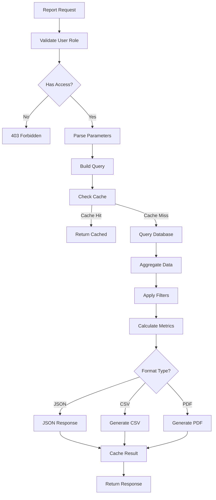

### 4. File Upload Flow

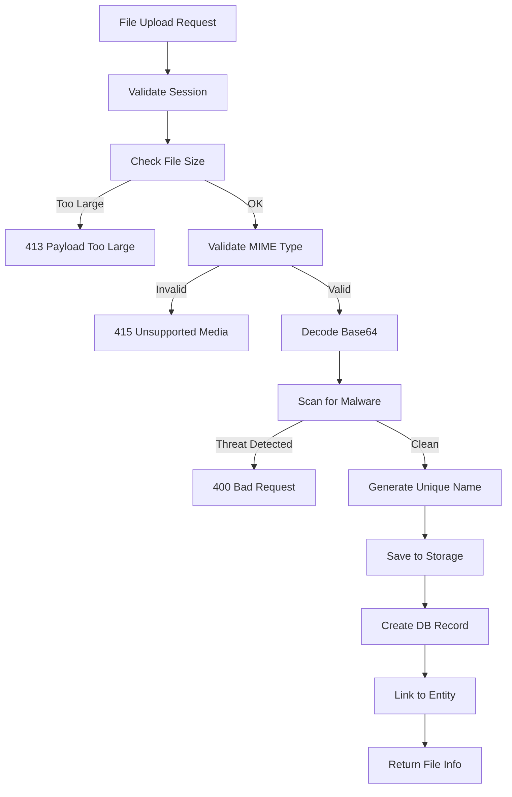

## Error Handling & Response Patterns

### Standard Response Format

#### Success Response
```json
{
  "success": true,
  "data": { /* actual response data */ },
  "message": "Operation completed successfully",
  "timestamp": "2024-01-01T00:00:00Z"
}
```

#### Error Response
```json
{
  "success": false,
  "error": {
    "code": "VALIDATION_ERROR",
    "message": "Invalid request parameters",
    "details": [
      {
        "field": "email",
        "message": "Invalid email format"
      }
    ]
  },
  "timestamp": "2024-01-01T00:00:00Z"
}
```

### Error Codes

| Code | HTTP Status | Description |
|------|------------|-------------|
| `UNAUTHORIZED` | 401 | Missing or invalid authentication |
| `FORBIDDEN` | 403 | Insufficient permissions |
| `NOT_FOUND` | 404 | Resource not found |
| `VALIDATION_ERROR` | 400 | Request validation failed |
| `DUPLICATE_ENTRY` | 409 | Resource already exists |
| `RATE_LIMITED` | 429 | Too many requests |
| `INTERNAL_ERROR` | 500 | Server error |
| `SERVICE_UNAVAILABLE` | 503 | Service temporarily unavailable |

### Error Handling Flow

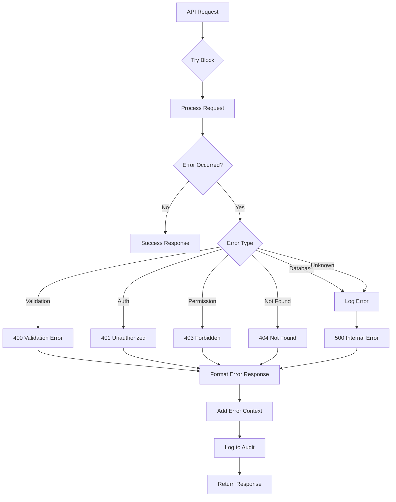

## Security & Rate Limiting

### Security Measures

1. **Authentication Requirements**
   - All endpoints require authentication (session or API key)
   - Exceptions: `/api/health`, `/api/auth/signin`

2. **Role-Based Access Control (RBAC)**
   ```typescript
   enum Role {
     SUPER_ADMIN,  // Full system access
     ADMIN,        // Administrative functions
     MANAGER,      // Branch/team management
     MANAGER_IT,   // IT management functions
     TECHNICIAN,   // Ticket handling
     AGENT,        // Limited ticket creation
     USER,         // Basic user access
     SECURITY_ANALYST // Security monitoring
   }
   ```

3. **Input Validation**
   - Zod schema validation on all inputs
   - SQL injection prevention via Prisma parameterized queries
   - XSS prevention through input sanitization
   - File upload restrictions (type, size)

4. **Rate Limiting**
   - Session-based: 100 requests per minute
   - API key-based: Configurable per key
   - Endpoint-specific limits for sensitive operations

5. **Audit Logging**
   - All state-changing operations logged
   - User identification and IP tracking
   - Timestamp and operation details

### Rate Limiting Implementation

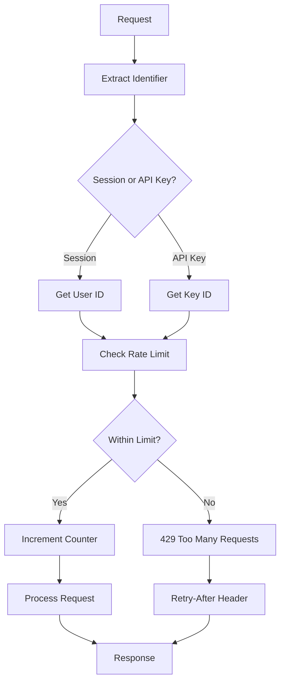

### API Key Management

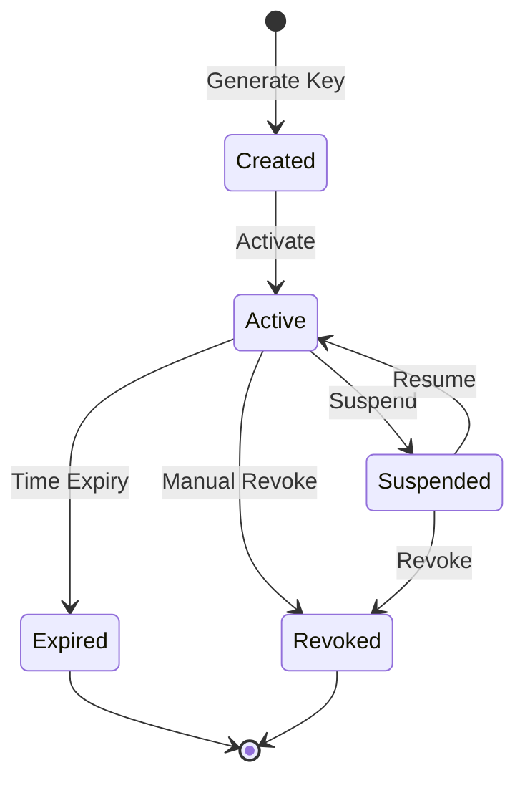

## Integration Patterns

### 1. Webhook Integration

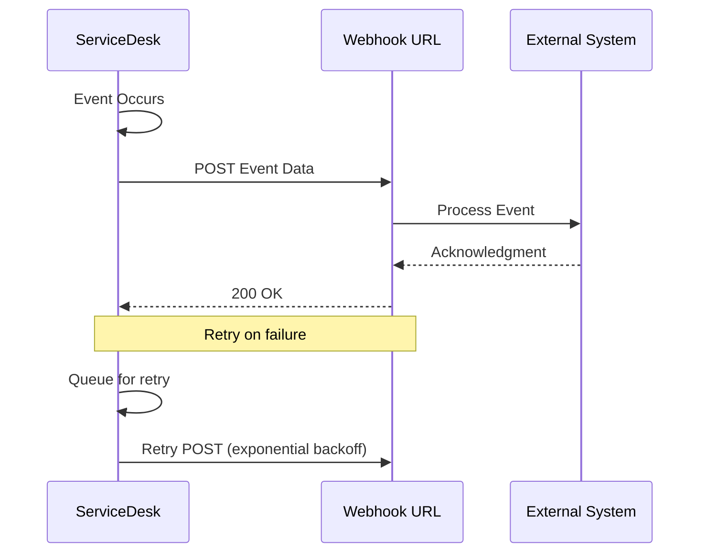

### 2. Polling Integration

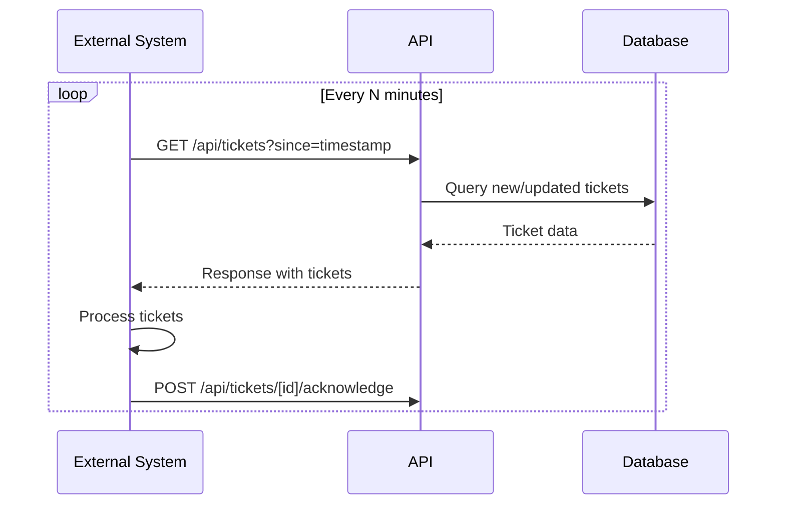

### 3. Event-Driven Integration (Socket.io)

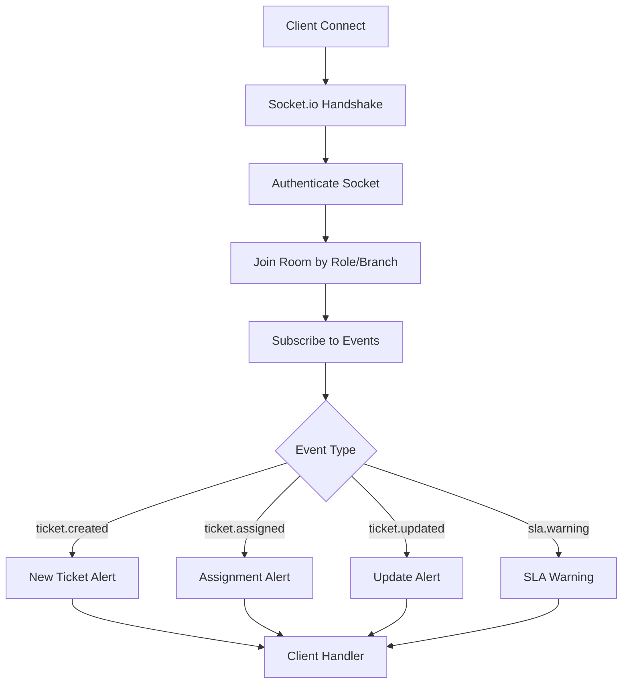

## Appendix: Complete API Endpoint List

### Authentication & Authorization
- `POST /api/auth/[...nextauth]` - NextAuth.js authentication
- `POST /api/auth/change-password` - Change user password
- `POST /api/auth/forgot-password` - Request password reset
- `POST /api/auth/reset-password` - Reset password with token
- `GET /api/auth/activity` - Get user activity logs
- `GET /api/auth/login-attempts` - Get login attempt history

### Ticket Management
- `GET /api/tickets` - List tickets
- `POST /api/tickets` - Create ticket
- `GET /api/tickets/[id]` - Get ticket details
- `PUT /api/tickets/[id]` - Update ticket
- `DELETE /api/tickets/[id]` - Delete ticket
- `PUT /api/tickets/[id]/status` - Update status
- `POST /api/tickets/[id]/assign` - Assign ticket
- `POST /api/tickets/[id]/claim` - Claim ticket
- `GET /api/tickets/[id]/comments` - Get comments
- `POST /api/tickets/[id]/comments` - Add comment
- `GET /api/tickets/[id]/tasks` - Get tasks
- `POST /api/tickets/[id]/tasks` - Add task
- `GET /api/tickets/[id]/attachments/[attachmentId]/download` - Download attachment
- `POST /api/tickets/bulk/assign` - Bulk assign
- `POST /api/tickets/bulk/status` - Bulk status update
- `POST /api/tickets/atm-claim` - Create ATM claim

### Admin Management
- `GET /api/admin/users` - List users
- `POST /api/admin/users` - Create user
- `PUT /api/admin/users/[id]` - Update user
- `DELETE /api/admin/users/[id]` - Delete user
- `GET /api/admin/services` - List services
- `POST /api/admin/services` - Create service
- `GET /api/admin/branches` - List branches
- `POST /api/admin/branches` - Create branch
- `GET /api/admin/categories` - List categories
- `POST /api/admin/categories` - Create category
- `GET /api/admin/support-groups` - List support groups
- `POST /api/admin/support-groups` - Create support group
- `GET /api/admin/api-keys` - List API keys
- `POST /api/admin/api-keys` - Create API key
- `POST /api/admin/import` - Import data
- `GET /api/admin/import/rollback` - Rollback import

### Monitoring
- `GET /api/monitoring/network/status` - Network status
- `GET /api/monitoring/network/performance` - Network performance
- `GET /api/monitoring/atms/status` - ATM status
- `POST /api/monitoring/atms/ping` - Ping ATMs
- `GET /api/monitoring/branches/status` - Branch status
- `POST /api/monitoring/branches/ping` - Ping branches
- `GET /api/monitoring/incidents` - List incidents
- `POST /api/monitoring/incidents` - Create incident

### Reporting
- `GET /api/reports/tickets/all-tickets` - All tickets report
- `GET /api/reports/admin/service-catalog` - Service catalog report
- `GET /api/reports/admin/sla-performance` - SLA performance
- `GET /api/reports/manager/branch-operations` - Branch operations
- `GET /api/reports/manager/team-performance` - Team performance
- `GET /api/reports/technician/performance` - Technician performance
- `GET /api/reports/infrastructure/atm-intelligence` - ATM intelligence
- `GET /api/reports/compliance/security` - Security compliance

### Public APIs
- `POST /api/public/claims` - Submit claim (API key required)
- `GET /api/public/ticket-status` - Check ticket status (API key required)

### Utility Endpoints
- `GET /api/health` - Health check
- `POST /api/upload` - File upload
- `GET /api/files/[filename]` - Download file
- `GET /api/dashboard` - Dashboard data

---

## Version History

| Version | Date | Description |
|---------|------|-------------|
| 1.0.0 | 2024-11-08 | Initial comprehensive API documentation |

## Contact & Support

For API support and questions:
- **Internal Support**: servicedesk@banksulutgo.co.id
- **Documentation**: This document and inline API documentation
- **Status Page**: https://status.banksulutgo.co.id