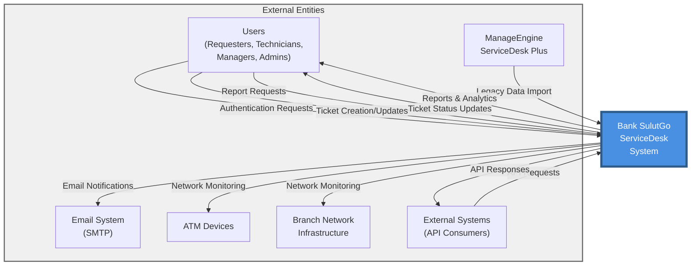
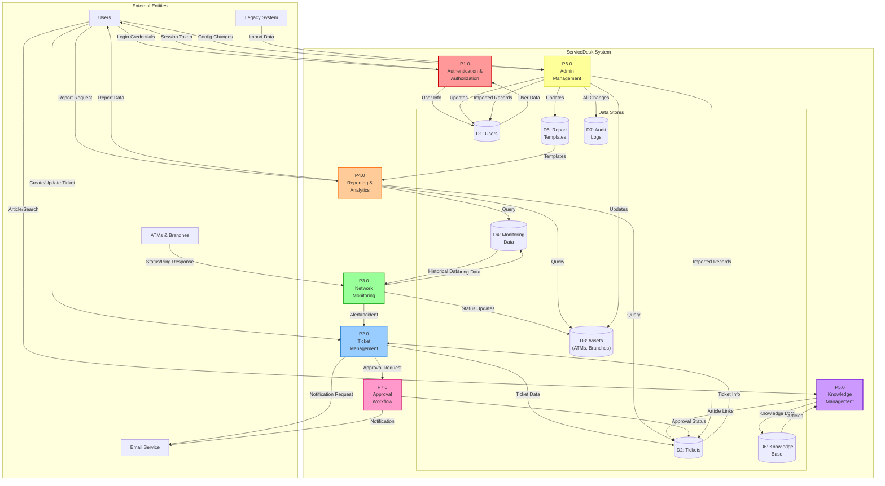
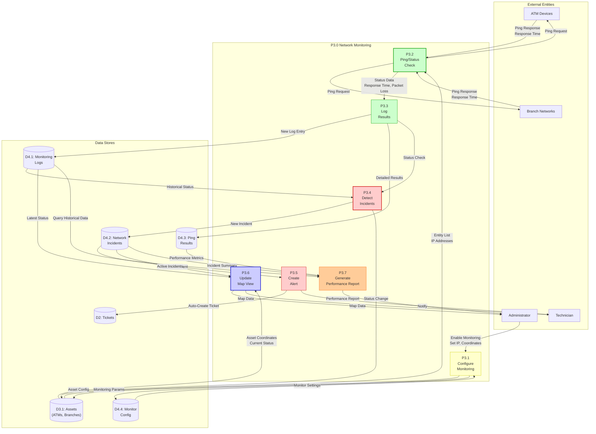
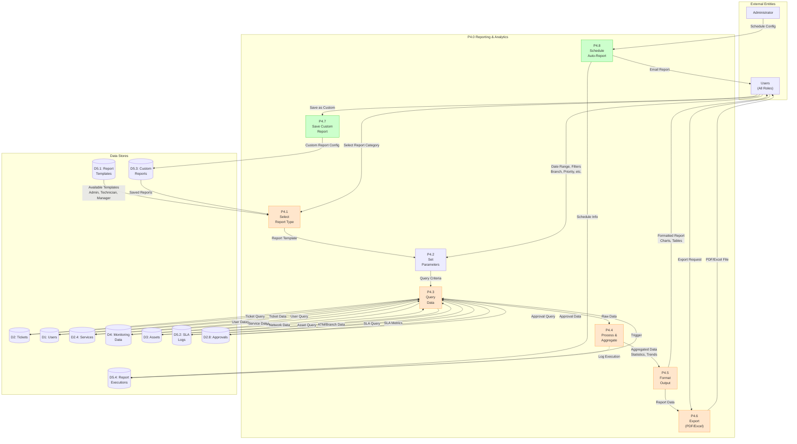

# Bank SulutGo ServiceDesk - Dataflow Diagram

This document provides comprehensive dataflow diagrams for the ServiceDesk application, showing how data moves through the system.

## Table of Contents
1. [Context Diagram (Level 0)](#context-diagram-level-0)
2. [Level 1 - Main System Processes](#level-1---main-system-processes)
3. [Level 2 - Ticket Management Subsystem](#level-2---ticket-management-subsystem)
4. [Level 3 - Network Monitoring Subsystem](#level-3---network-monitoring-subsystem)
5. [Level 4 - Reporting Subsystem](#level-4---reporting-subsystem)
6. [Data Store Details](#data-store-details)

---

## Context Diagram (Level 0)

The highest-level view showing the ServiceDesk system and its external entities.



---

## Level 1 - Main System Processes

Major functional areas of the ServiceDesk system.



---

## Level 2 - Ticket Management Subsystem

Detailed view of ticket management processes.

```mermaid
flowchart TB
    subgraph External["External Entities"]
        Requester["Requester"]
        Technician["Technician"]
        Manager["Manager"]
        Email["Email System"]
    end

    subgraph TicketMgmt["P2.0 Ticket Management"]
        CreateTicket["P2.1<br/>Create<br/>Ticket"]
        AssignTicket["P2.2<br/>Assign<br/>Ticket"]
        UpdateTicket["P2.3<br/>Update<br/>Status"]
        AddComment["P2.4<br/>Add<br/>Comments"]
        ResolveTicket["P2.5<br/>Resolve<br/>Ticket"]
        CloseTicket["P2.6<br/>Close<br/>Ticket"]
        AttachFiles["P2.7<br/>Handle<br/>Attachments"]
        CheckSLA["P2.8<br/>SLA<br/>Monitoring"]
    end

    subgraph DataStores["Data Stores"]
        TicketDB[("D2.1: Tickets")]
        CommentDB[("D2.2: Comments")]
        AttachDB[("D2.3: Attachments")]
        ServiceDB[("D2.4: Services")]
        UserDB[("D1: Users")]
        SupportDB[("D2.5: Support<br/>Groups")]
        TaskDB[("D2.6: Tasks")]
        SLADB[("D2.7: SLA<br/>Config")]
        ApprovalDB[("D2.8: Approvals")]
    end

    Requester -->|Ticket Details<br/>Service, Priority, Description| CreateTicket
    CreateTicket -->|Service Info| ServiceDB
    ServiceDB -->|Service Details<br/>SLA, Support Group| CreateTicket
    CreateTicket -->|New Ticket| TicketDB
    CreateTicket -->|Auto-assign| AssignTicket
    CreateTicket -->|Email: Ticket Created| Email

    Manager -->|Assignment| AssignTicket
    AssignTicket -->|Support Group| SupportDB
    SupportDB -->|Available Technicians| AssignTicket
    AssignTicket -->|Technician Assignment| TicketDB
    AssignTicket -->|Email: Ticket Assigned| Email

    Technician -->|Status Update| UpdateTicket
    UpdateTicket -->|Update Status| TicketDB
    UpdateTicket -->|Check SLA| CheckSLA
    CheckSLA -->|SLA Rules| SLADB
    CheckSLA -->|Breach Alert| Email
    UpdateTicket -->|Email: Status Changed| Email

    Requester -->|Comment/Question| AddComment
    Technician -->|Response/Update| AddComment
    AddComment -->|Comment Data| CommentDB
    CommentDB -->|Comment History| AddComment
    AddComment -->|Email: New Comment| Email

    Requester -->|Files| AttachFiles
    Technician -->|Files/Screenshots| AttachFiles
    AttachFiles -->|File Metadata| AttachDB
    AttachDB -->|File References| AttachFiles

    Technician -->|Resolution Details| ResolveTicket
    ResolveTicket -->|Resolved Status| TicketDB
    ResolveTicket -->|Create Tasks| TaskDB
    TaskDB -->|Task List| ResolveTicket
    ResolveTicket -->|Email: Ticket Resolved| Email

    Requester -->|Confirmation| CloseTicket
    Manager -->|Force Close| CloseTicket
    CloseTicket -->|Closed Status| TicketDB
    CloseTicket -->|Email: Ticket Closed| Email

    CreateTicket -.->|If Approval Required| ApprovalDB
    ApprovalDB -.->|Approval Status| AssignTicket

    style CreateTicket fill:#cce5ff,stroke:#0066cc
    style AssignTicket fill:#cce5ff,stroke:#0066cc
    style UpdateTicket fill:#cce5ff,stroke:#0066cc
    style AddComment fill:#cce5ff,stroke:#0066cc
    style ResolveTicket fill:#cce5ff,stroke:#0066cc
    style CloseTicket fill:#cce5ff,stroke:#0066cc
    style AttachFiles fill:#cce5ff,stroke:#0066cc
    style CheckSLA fill:#ffcccc,stroke:#cc0000
```



---

## Level 3 - Network Monitoring Subsystem

Detailed view of network monitoring processes.



---

## Level 4 - Reporting Subsystem

Detailed view of reporting and analytics processes.



---

## Data Flow Summary by Feature

### Authentication Flow
```
User → Login Credentials → P1.0 Auth Process → Query → D1 Users
D1 Users → User Record → P1.0 Auth Process → JWT Token → User
P1.0 Auth Process → Login Attempt → D7 Audit Logs
```

### Ticket Creation Flow
```
Requester → Ticket Details → P2.1 Create Ticket → Service Lookup → D2.4 Services
D2.4 Services → SLA & Support Group → P2.1 Create Ticket
P2.1 Create Ticket → New Ticket → D2.1 Tickets
P2.1 Create Ticket → Auto-assign → P2.2 Assign Ticket
P2.1 Create Ticket → Notification → Email System
P2.1 Create Ticket → Audit Entry → D7 Audit Logs
```

### Network Monitoring Flow
```
Cron Job → Trigger → P3.2 Ping Check → Entity List → D3.1 Assets
P3.2 Ping Check → Ping → ATMs/Branches
ATMs/Branches → Response → P3.2 Ping Check → Status → P3.3 Log Status
P3.3 Log Status → Log Entry → D4.1 Monitoring Logs
P3.3 Log Status → Ping Result → D4.3 Ping Results
P3.3 Log Status → Status → P3.4 Detect Incident
P3.4 Detect Incident → Incident → D4.2 Incidents
P3.4 Detect Incident → Alert → P3.5 Create Alert
P3.5 Create Alert → Auto-Ticket → D2.1 Tickets
```

### Report Generation Flow
```
User → Report Request → P4.1 Select Report → Template → D5.1 Templates
P4.1 Select Report → Params → P4.2 Set Parameters
P4.2 Set Parameters → Criteria → P4.3 Query Data
P4.3 Query Data → Multi-table Query → D2 Tickets, D4 Monitoring, D3 Assets
Data Stores → Raw Data → P4.3 Query Data → Aggregate → P4.4 Process Data
P4.4 Process Data → Stats → P4.5 Format Report → Visual Report → User
User → Export → P4.6 Export → PDF/Excel → User
```

### Approval Workflow Flow
```
P2.1 Create Ticket → Check Service → D2.4 Services
D2.4 Services → Approval Required → P7.1 Initiate Approval
P7.1 Initiate Approval → Approval Record → D2.8 Approvals
P7.1 Initiate Approval → Notify → Email → Manager
Manager → Decision → P7.2 Process Approval
P7.2 Process Approval → Update → D2.8 Approvals
P7.2 Process Approval → Release Ticket → P2.2 Assign Ticket
P7.2 Process Approval → Notify → Email → Requester
```

---

## Data Store Details

### D1: Users
**Contains:** User accounts, authentication, roles, branches
**Key Fields:** id, email, password, role, branchId, isActive
**Used By:** P1.0 Authentication, P2.0 Ticket Management, P4.0 Reporting, P6.0 Admin

### D2: Tickets (Main)
**Contains:** All service requests and incidents
**Key Fields:** id, ticketNumber, status, priority, serviceId, assignedToId
**Used By:** P2.0 Ticket Management, P3.0 Monitoring, P4.0 Reporting, P7.0 Approval

### D2.1: Tickets (Extended)
**Contains:** Ticket details, history, SLA tracking
**Related:** Comments, Attachments, Tasks, Approvals

### D2.2: Comments
**Contains:** Ticket comments and communications
**Key Fields:** id, ticketId, userId, content, createdAt

### D2.3: Attachments
**Contains:** File uploads linked to tickets
**Key Fields:** id, ticketId, filename, path, size, mimeType

### D2.4: Services
**Contains:** Service catalog with SLA definitions
**Key Fields:** id, name, categoryId, tier1CategoryId, slaResponseMinutes

### D2.5: Support Groups
**Contains:** Technical support teams
**Key Fields:** id, name, description, members

### D2.6: Tasks
**Contains:** Checklist items for ticket resolution
**Key Fields:** id, ticketId, description, completed, completedBy

### D2.7: SLA Config
**Contains:** SLA rules and breach thresholds
**Key Fields:** id, serviceId, responseMinutes, resolutionMinutes

### D2.8: Approvals
**Contains:** Multi-level approval workflow
**Key Fields:** id, ticketId, level, approverId, status, decision

### D3: Assets
**Contains:** ATMs, Branches, PC Assets
**Key Fields:** id, type, name, code, ipAddress, latitude, longitude

### D3.1: Assets (ATMs & Branches)
**Contains:** Network-enabled assets for monitoring
**Key Fields:** ipAddress, latitude, longitude, monitoringEnabled

### D4: Monitoring Data
**Contains:** Network performance and status data

### D4.1: Monitoring Logs
**Contains:** Status check results over time
**Key Fields:** id, entityType, entityId, status, responseTimeMs, checkedAt

### D4.2: Network Incidents
**Contains:** Network outages and issues
**Key Fields:** id, entityType, entityId, status, severity, createdAt

### D4.3: Ping Results
**Contains:** Detailed ping statistics
**Key Fields:** id, entityId, responseTime, packetLoss, timestamp

### D4.4: Monitor Config
**Contains:** Monitoring parameters and schedules
**Key Fields:** id, checkInterval, alertThresholds, enabled

### D5: Report Templates
**Contains:** Pre-configured report definitions

### D5.1: Report Templates
**Contains:** System and custom report definitions
**Key Fields:** id, name, type, query, parameters, module

### D5.2: SLA Logs
**Contains:** Historical SLA performance data
**Key Fields:** id, ticketId, responseTime, resolutionTime, breached

### D5.3: Custom Reports
**Contains:** User-created reports
**Key Fields:** id, userId, name, config, isShared

### D5.4: Report Executions
**Contains:** Report run history and schedules
**Key Fields:** id, reportId, executedAt, parameters, result

### D6: Knowledge Base
**Contains:** Articles, solutions, documentation
**Key Fields:** id, title, content, categoryId, views, helpful

### D7: Audit Logs
**Contains:** All system changes and actions
**Key Fields:** id, userId, action, entity, oldValue, newValue, timestamp

---

## Data Flow Characteristics

### Real-Time Flows
- Network monitoring (ping checks every 5-30 minutes)
- Ticket status updates
- User authentication
- SLA breach detection

### Batch Flows
- Report generation (on-demand or scheduled)
- Data import from legacy systems
- Bulk email notifications
- Database backups

### Asynchronous Flows
- Email notifications
- File uploads/downloads
- Long-running reports
- Background monitoring checks

### Synchronous Flows
- User login/authentication
- Ticket CRUD operations
- Search queries
- API requests

---

## Security & Access Control Data Flows

All data flows through the authentication layer (P1.0) which:
1. Validates user session/JWT token
2. Checks role-based permissions
3. Filters data based on branch access (for non-admin users)
4. Logs all access attempts to D7 Audit Logs
5. Enforces rate limiting on API endpoints

---

*This dataflow diagram is maintained as part of the ServiceDesk technical documentation.*
*Last Updated: 2025-11-05*
