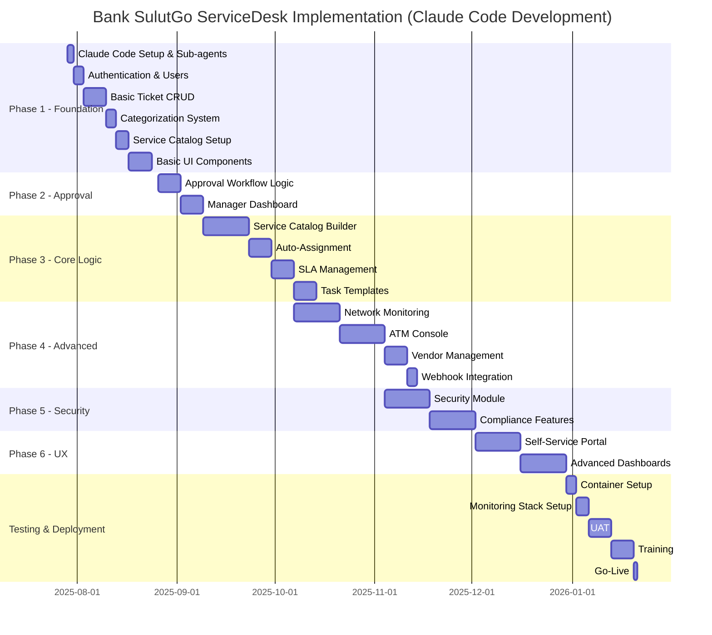

# Product Requirements Document (PRD)
# Bank SulutGo ServiceDesk

**Version:** 1.1  
**Date:** July 27, 2025  
**Status:** Draft (Revised)  
**Author:** IT Service Management Team

---

## Table of Contents
1. [Executive Summary](#executive-summary)
2. [Problem Statement](#problem-statement)
3. [Goals and Objectives](#goals-and-objectives)
4. [User Personas](#user-personas)
5. [Product Overview](#product-overview)
6. [Functional Requirements](#functional-requirements)
7. [Non-Functional Requirements](#non-functional-requirements)
8. [Technical Architecture](#technical-architecture)
9. [Success Metrics](#success-metrics)
10. [Implementation Roadmap](#implementation-roadmap)
11. [Risks and Mitigations](#risks-and-mitigations)
12. [Appendices](#appendices)

---

## Executive Summary

The Bank SulutGo ServiceDesk is a comprehensive ITIL v4-compliant service management system designed to streamline IT support operations across 295 ATM/CRM terminals and 83 branches. The system will replace the current BSG ticketing system, enhancing it with modern workflow automation, real-time monitoring, and intelligent ticket routing.

### Key Features
- **Technician-managed service catalog** as the primary user interface for simplified ticket creation
- **Automated categorization** through service selection, ensuring consistent data quality
- **Branch-based approval workflows** ensuring proper oversight of service requests
- **Automated ticket assignment** with workload balancing for IT Helpdesk team (5 technicians)
- **Smart routing** directing KASDA user management to Dukungan dan Layanan staff
- **Real-time network monitoring** for 24/7 ATM availability
- **Manual service catalog building** through intuitive interfaces
- **Advanced SLA management** with automated escalation and breach prevention
- **Integrated vendor management** for coordinated third-party support
- **Comprehensive ticket categorization** with 3-tier structure and issue classification for actionable insights

### Expected Outcomes
- 40% reduction in ticket resolution time through automation
- 99.9% ATM availability through proactive monitoring
- 60% decrease in approval bottlenecks via bulk operations
- Complete ITIL v4 compliance for audit requirements
- Data-driven insights enabling preventive measures and continuous improvement
- 30% reduction in repeat issues through root cause elimination
- 25% cost savings from preventing recurring problems

---

## Problem Statement

### Current Challenges

1. **Manual Approval Bottlenecks**
   - Branch managers must individually approve each ticket from their employees
   - No bulk approval capabilities leading to service delays
   - Lack of visibility into pending approvals

2. **Inefficient Ticket Distribution**
   - Manual assignment causing uneven workload distribution among IT Helpdesk team
   - No consideration of technician availability within the 5-person team
   - Delayed response times during peak periods
   - Confusion when KASDA services incorrectly routed to IT Helpdesk

3. **Limited ATM Monitoring**
   - Reactive approach to ATM failures
   - No automated incident creation for network issues
   - Poor vendor coordination for hardware problems

4. **BSG System Limitations**
   - No ITIL compliance framework
   - Limited reporting and analytics
   - No real-time status updates
   - Lack of integration with modern tools
   - No proper categorization or root cause tracking
   - Cannot identify patterns or trends in issues
   - No insights for preventive measures

5. **Security Incident Management Gap**
   - No confidential ticket handling for cyber security incidents
   - Limited audit trail for security-related issues
   - Poor coordination between security and IT operations teams

### Current Support Group Structure

The bank currently operates with two support groups:

1. **IT Helpdesk** (5 technicians)
   - Handles approximately 239 of 240 services
   - Responsible for all general IT support
   - Manages ATM/hardware issues
   - Handles network and infrastructure problems
   - Supports all business applications except KASDA

2. **Dukungan dan Layanan** 
   - Exclusively handles KASDA application user management
   - Manages user access requests for KASDA
   - Handles password resets and account issues for KASDA

This structure creates challenges in workload distribution, with IT Helpdesk handling the vast majority of tickets while Dukungan dan Layanan has a very specific, limited scope.

### Business Impact
- **Customer Service**: ATM downtime directly impacts customer satisfaction
- **Operational Efficiency**: Manual processes consume 30% more resources
- **Compliance Risk**: Lack of ITIL compliance poses audit risks
- **Financial Impact**: Delayed issue resolution costs estimated at $500K annually
- **Strategic Blind Spots**: No data on root causes prevents proactive improvements
- **Hidden Costs**: Repeat issues and preventable incidents cost additional $300K annually

---

## Goals and Objectives

### Primary Goals

1. **Modernize Service Delivery**
   - Implement ITIL v4-compliant processes
   - Automate routine tasks and approvals
   - Enable self-service capabilities

2. **Ensure 24/7 Service Availability**
   - Achieve 99.9% ATM uptime
   - Proactive network monitoring
   - Rapid incident response

3. **Improve Operational Efficiency**
   - Reduce average resolution time by 40%
   - Decrease approval wait time by 60%
   - Optimize technician utilization to 80%

4. **Enable Data-Driven Decision Making**
   - Identify root causes of recurring issues
   - Reduce human errors through training insights
   - Optimize resource allocation based on categorization data
   - Predict and prevent system failures

### Specific Objectives

| Objective | Current State | Target State | Timeline |
|-----------|--------------|--------------|----------|
| Ticket Resolution Time | 48 hours | 28 hours | 6 months |
| First Contact Resolution | 45% | 70% | 12 months |
| ATM Availability | 97% | 99.9% | 3 months |
| Approval Processing | 4 hours | 30 minutes | 3 months |
| SLA Compliance | 75% | 95% | 6 months |
| User Satisfaction | 3.2/5 | 4.5/5 | 12 months |
| Root Cause Identification | Unknown | 95% of tickets | 6 months |
| Human Error Rate | Unknown | <20% | 12 months |
| Preventable Incidents | Unknown | <30% | 12 months |
| Issue Pattern Recognition | None | Automated | 3 months |

---

## User Personas

### 1. Branch Employee (Requester)
- **Name**: Sarah, Customer Service Officer
- **Location**: Manado Main Branch
- **Tech Savvy**: Moderate
- **Needs**:
  - Easy-to-browse service catalog
  - Clear service descriptions
  - Simple form filling based on selected service
  - Track ticket progress
  - Receive timely updates
- **Pain Points**:
  - Difficult to find the right service
  - Too many fields to fill
  - Waiting for manager approval
  - No visibility into resolution timeline

### 2. Branch Manager
- **Name**: John, Branch Manager
- **Location**: Bitung Branch
- **Tech Savvy**: Basic to Moderate
- **Needs**:
  - Efficient approval process
  - Visibility into branch IT requests
  - Bulk approval capabilities
  - Approval delegation during absence
- **Pain Points**:
  - Too many individual approvals
  - No mobile approval option
  - Limited context for decision-making

### 3. IT Helpdesk Technician
- **Name**: Mike, IT Support Specialist
- **Team**: IT Helpdesk (1 of 5 technicians)
- **Tech Savvy**: Advanced
- **Needs**:
  - Service catalog management tools
  - Easy field configuration interface
  - Category management capabilities
  - Clear task prioritization among team members
  - Access to ticket history
  - Vendor coordination tools
  - Knowledge base integration
  - Fair workload distribution
- **Pain Points**:
  - Manual service configuration
  - Inconsistent categorization
  - Uneven workload distribution within 5-person team
  - Manual vendor ticket tracking
  - Repetitive issue resolution
  - Handling almost all service types

### 4. KASDA Support Staff
- **Name**: Rina, Application Support
- **Team**: Dukungan dan Layanan
- **Tech Savvy**: Moderate
- **Needs**:
  - Clear identification of KASDA tickets
  - User management tools
  - Access request workflows
  - KASDA-specific knowledge base
- **Pain Points**:
  - Tickets sometimes misrouted to IT Helpdesk
  - Limited ticket volume
  - Manual user provisioning
  - No integrated KASDA management tools

### 5. ATM Support Specialist
- **Name**: Lisa, ATM Operations Technician
- **Tech Savvy**: Advanced
- **Needs**:
  - Real-time ATM status monitoring
  - Automated incident creation
  - Vendor management tools
  - Maintenance scheduling
- **Pain Points**:
  - Reactive problem detection
  - Poor vendor communication
  - Manual status tracking

### 6. Service Manager
- **Name**: David, IT Service Manager
- **Tech Savvy**: Moderate to Advanced
- **Needs**:
  - Comprehensive reporting
  - SLA monitoring
  - Resource optimization
  - Trend analysis
  - Root cause analytics
  - Department-wise performance metrics
  - Actionable insights from categorization data
- **Pain Points**:
  - Limited visibility into metrics
  - Manual report generation
  - Difficulty identifying bottlenecks
  - No data on issue patterns or root causes
  - Cannot identify training needs or system weaknesses

### 7. Cyber Security Analyst
- **Name**: Anna, Security Operations Analyst
- **Unit**: Ketahanan dan Keamanan Siber
- **Tech Savvy**: Advanced
- **Needs**:
  - Confidential ticket management
  - Secure incident tracking
  - Audit trail maintenance
  - Integration with security tools
- **Pain Points**:
  - No secure incident handling
  - Limited access controls
  - Poor security event correlation

---

## Product Overview

### System Architecture Overview

```
┌─────────────────────────────────────────────────────────────┐
│                    User Interfaces                           │
├─────────────────┬────────────────┬──────────────────────────┤
│ Self-Service    │ Technician     │ Management               │
│ Portal          │ Workbench      │ Dashboard                │
└────────┬────────┴────────┬───────┴────────┬─────────────────┘
         │                 │                │
┌────────▼─────────────────▼────────────────▼─────────────────┐
│                    Application Layer                         │
├──────────────────────────────────────────────────────────────┤
│ • Ticket Management  • Approval Engine  • SLA Monitor        │
│ • Auto-Assignment    • Network Monitor  • Vendor Integration │
│ • Service Catalog    • Security Module  • Reporting          │
└────────────────────────────┬─────────────────────────────────┘
                            │
┌───────────────────────────▼─────────────────────────────────┐
│                    Data Layer                                │
├─────────────────────────────────┬────────────────────────────┤
│ PostgreSQL                      │ File Storage               │
└─────────────────────────────────┴────────────────────────────┘
```

### Core Modules

1. **Ticket Management System**
   - Complete ticket lifecycle management
   - Dynamic field support
   - Attachment handling
   - Communication threading
   - 3-tier categorization enforcement
   - Issue classification tracking
   - Root cause analysis capabilities

2. **Approval Workflow Engine**
   - Role-based approval routing
   - Bulk approval operations
   - Delegation capabilities
   - Approval analytics

3. **Service Catalog Management**
   - **Service Template Builder**:
     - Visual service creation interface
     - Dynamic field configuration (user-facing and technician-only)
     - Category assignment with 3-tier structure
     - Field dependency and conditional logic builder
     - Preview and testing capabilities
   - **Field Management**:
     - Multiple dynamic field types
     - Validation rule configuration
     - Master data management (dropdowns, options)
     - Field visibility controls
   - **Category Management**:
     - Create and manage category hierarchies
     - Bulk categorization tools
     - Auto-suggestion based on patterns
   - SLA template mapping
   - Task template generation
   - Version control for service changes

4. **Network Monitoring System**
   - Real-time endpoint monitoring
   - Automated incident creation
   - Performance analytics
   - Escalation management

5. **Vendor Integration Platform**
   - Third-party ticket tracking
   - Vendor performance metrics
   - SLA compliance monitoring
   - Communication logging

6. **Security Incident Management**
   - Confidential ticket classification
   - Restricted access controls
   - Audit trail maintenance
   - Security tool integration

7. **Analytics & Insights Engine**
   - Real-time categorization analytics
   - Issue pattern recognition
   - Predictive maintenance models
   - Training needs identification
   - Cost analysis by root cause

---

## Functional Requirements

### Phase 1: Foundation (Weeks 1-4)

#### 1.1 User Authentication & Authorization
**Priority**: P0 - Critical

**Requirements**:
- Implement secure JWT-based authentication using NextAuth.js
- Support for email/password login with future LDAP/AD integration capability
- Role-based access control (USER, TECHNICIAN, MANAGER, ADMIN)
- Branch-level data isolation for users and managers
- Session management with timeout and renewal
- Password complexity requirements and account lockout policies

**Acceptance Criteria**:
- Users can securely log in and log out
- Role permissions are properly enforced
- Branch isolation prevents cross-branch data access
- Sessions expire after 30 minutes of inactivity

#### 1.2 Basic Ticket CRUD Operations
**Priority**: P0 - Critical

**Requirements**:
- **Ticket Creation Process**:
  - Users browse/search service catalog to find appropriate service
  - Select service which auto-populates category/subcategory/item
  - Fill dynamic fields configured for that service
  - System validates all required fields
  - Automatic priority suggestion based on service type
- **Ticket Management**:
  - View ticket list with pagination and filters
  - View ticket details with full history
  - Update ticket status and add comments
  - Delete tickets (admin only)
  - File attachment support (up to 10MB per file)
- **Technician Processing**:
  - Access additional technician-only fields for selected service
  - Update issue classification before resolution
  - Add root cause analysis
  - Link to knowledge base articles

**Acceptance Criteria**:
- Service catalog selection enforced for ticket creation
- Categories automatically applied from service configuration
- All CRUD operations work correctly
- Issue classification required before resolution
- Data validation prevents invalid inputs
- Proper error handling and user feedback
- Audit trail captures all changes

#### 1.3 Ticket Categorization & Classification System
**Priority**: P0 - Critical

**Requirements**:
- **Service-Driven Categorization**:
  - Categories are configured per service by technicians
  - When users select a service, categorization is automatic
  - No manual category selection by users (reduces errors)
  - Technicians can bulk update categories for multiple services
  - Category inheritance for similar services
- **3-Tier Category Structure** (configured at service level):
  - Level 1: Category (e.g., Hardware, Software, Network, Application)
  - Level 2: Subcategory (e.g., Hardware → ATM, Desktop, Printer)
  - Level 3: Item (e.g., ATM → Card Reader, Cash Dispenser, Screen)
- **Issue Classification Types** (selected by technicians during resolution):
  - Human Error (User mistake, Training issue, Misconfiguration)
  - System Error (Software bug, Application crash, Service failure)
  - Hardware Failure (Component failure, Physical damage, Wear and tear)
  - Network Issue (Connectivity, Bandwidth, Latency)
  - Security Incident (Unauthorized access, Malware, Policy violation)
  - Data Issue (Corruption, Loss, Inconsistency)
  - Process Gap (Missing procedure, Inefficient workflow)
  - External Factor (Power outage, Vendor issue, Natural disaster)
- **Root Cause Analysis Fields**:
  - Primary cause selection
  - Contributing factors (multiple selection)
  - Preventive measures taken
  - Knowledge base article created (yes/no)

**Acceptance Criteria**:
- Service configuration includes mandatory categorization
- Categories automatically applied when service selected
- Issue classification mandatory for ticket resolution
- Reports can aggregate by any categorization level
- Historical data shows classification trends
- Knowledge base integration for common issues

#### 1.4 Service Catalog Structure
**Priority**: P0 - Critical

**Requirements**:
- **Service Catalog Management by Technicians/Admins**:
  - Create and manage service templates
  - Define service name, description, and help text
  - Configure 3-tier categorization for each service
  - Set up user-facing dynamic fields (what users fill when creating tickets)
  - Configure technician-only fields (additional data needed for processing)
  - Define field validation rules and dependencies
  - Set default values and field visibility conditions
- **User-Facing Service Selection**:
  - Browse services by category with search functionality
  - View service descriptions and expected resolution times
  - Fill only relevant fields based on selected service
  - Auto-populate category/subcategory/item based on service
- **Technician Field Management**:
  - Separate configuration for user-visible vs technician-only fields
  - Conditional field logic based on user inputs
  - Field templates for common service patterns
  - Ability to update fields without affecting existing tickets
- Support group assignment (IT Helpdesk for general services, Dukungan dan Layanan for KASDA)
- SLA configuration per service
- Clear identification of KASDA user management services

**Acceptance Criteria**:
- Technicians can create/edit service catalog entries
- Categories automatically applied when service is selected
- Dynamic fields work correctly for both users and technicians
- Field dependencies and validations enforced
- Services route to correct support group
- Existing tickets retain their field values when service is updated

### Phase 2: Approval Workflow (Weeks 5-6)

#### 2.1 Branch-Based Approval System
**Priority**: P0 - Critical

**Requirements**:
- Auto-detect when approval is required based on user role
- Automatically assign branch manager as approver
- Prevent ticket assignment until approved
- Support approval and rejection with reasons
- Email notifications for approval requests

**Acceptance Criteria**:
- Regular users' tickets go to PENDING_APPROVAL status
- Managers and technicians bypass approval
- Approval/rejection updates ticket status correctly
- Notifications sent within 1 minute

#### 2.2 Manager Approval Dashboard
**Priority**: P1 - High

**Requirements**:
- Dedicated dashboard showing pending approvals
- Bulk approval functionality
- Approval delegation to another manager
- Quick preview of ticket details
- Approval metrics and history

**Acceptance Criteria**:
- Managers see only their branch's pending tickets
- Bulk operations process multiple tickets
- Delegation works during manager absence
- Historical approvals are searchable

### Phase 3: Core Business Logic (Weeks 7-10)

#### 3.1 Service Catalog Management Interface
**Priority**: P1 - High

**Requirements**:
- **Service Creation & Management**:
  - Intuitive interface for technicians to create service templates
  - Drag-and-drop field builder for dynamic forms
  - Preview mode to see user-facing view
  - Version control for service changes
  - Import/export service templates
- **Categorization Configuration**:
  - Select or create categories during service setup
  - Auto-suggest categories based on service name
  - Enforce 3-tier structure (Category → Subcategory → Item)
  - Bulk categorization tools for multiple services
- **Dynamic Field Builder**:
  - Field types: text, number, dropdown, radio, checkbox, date, file upload
  - Set field properties: required, help text, validation rules
  - Configure field visibility (user-facing vs technician-only)
  - Conditional logic builder (if field A = X, show field B)
  - Field grouping and sections for better organization
- **Service Testing**:
  - Test mode to validate service configuration
  - Preview ticket creation flow
  - Validate field dependencies and rules
  - Check categorization accuracy

**Acceptance Criteria**:
- Non-technical staff can create services using visual builder
- All field types work correctly with validations
- Categorization is consistent and enforced
- Changes don't break existing tickets
- Service catalog searchable and well-organized

#### 3.2 Automated Ticket Assignment
**Priority**: P1 - High

**Requirements**:
- Automatic routing to IT Helpdesk (default) or Dukungan dan Layanan (KASDA services only)
- Round-robin assignment within IT Helpdesk (5 technicians)
- Consider technician workload and availability
- Special routing for KASDA user management services to Dukungan dan Layanan
- Manual override capability
- Assignment failure handling

**Acceptance Criteria**:
- Non-KASDA tickets auto-assign to IT Helpdesk within 30 seconds
- KASDA user management tickets route to Dukungan dan Layanan correctly
- Workload distributed evenly among IT Helpdesk technicians
- Manual reassignment works correctly
- Failed assignments alert supervisors

#### 3.3 SLA Management System
**Priority**: P1 - High

**Requirements**:
- SLA calculation based on priority and service
- Business hours vs 24/7 SLA tracking
- Breach prediction and prevention
- Automated escalation triggers using pg_cron scheduled jobs
- SLA pause during pending states
- Real-time SLA monitoring with database-triggered notifications

**Acceptance Criteria**:
- SLA targets calculated correctly
- Escalations trigger at defined thresholds via pg_cron jobs
- Reports show accurate compliance metrics
- Holiday calendars respected
- pg_cron jobs run reliably for SLA checks

#### 3.4 Task Management
**Priority**: P2 - Medium

**Requirements**:
- Predefined task templates per service
- Task checklist tracking
- Time tracking per task
- Knowledge base integration
- Task completion validation
- Link tasks to categorization for pattern analysis
- Track task completion by issue classification

**Acceptance Criteria**:
- Tasks display for relevant services
- Progress tracked accurately
- Time entries recorded properly
- Completion requires all required tasks
- Task patterns correlate with issue classifications

### Phase 4: Advanced Features (Weeks 11-16)

#### 4.1 Network Monitoring System
**Priority**: P1 - High

**Requirements**:
- Ping monitoring for all branches and ATMs
- Configurable monitoring intervals
- Automated incident creation for failures
- Performance degradation detection
- Network topology visualization
- Real-time status dashboard

**Acceptance Criteria**:
- All 378 endpoints monitored
- Incidents created within 2 minutes
- Dashboard updates in real-time
- Historical data retained for analysis

#### 4.2 ATM Operations Console
**Priority**: P1 - High

**Requirements**:
- ATM terminal inventory management
- Real-time status tracking
- Maintenance scheduling
- Vendor ticket integration
- Cash level monitoring alerts
- Geographic visualization

**Acceptance Criteria**:
- All 295 ATMs tracked
- Status updates reflect reality
- Maintenance prevents conflicts
- Vendor tickets linked properly

#### 4.3 Vendor Management Platform
**Priority**: P2 - Medium

**Requirements**:
- External ticket reference tracking
- Vendor contact management
- Performance metrics per vendor
- Communication logging
- SLA compliance tracking
- Automated status synchronization

**Acceptance Criteria**:
- Vendor tickets tracked accurately
- Performance reports generated
- Communications logged with timestamps
- SLA breaches identified

### Phase 5: Security & Compliance (Weeks 17-20)

#### 5.1 Cyber Security Incident Management
**Priority**: P1 - High

**Requirements**:
- Confidential ticket classification
- Restricted access controls
- Security-specific workflows
- Enhanced audit trails
- SIEM integration capability
- Incident response automation

**Acceptance Criteria**:
- Only authorized users access security tickets
- Audit trail tamper-proof
- Workflows match security procedures
- Integration points tested

#### 5.2 Compliance & Reporting
**Priority**: P2 - Medium

**Requirements**:
- ITIL v4 compliance workflows
- Automated compliance reports
- Data retention policies
- Audit trail integrity
- Export capabilities for auditors
- Role-based report access
- **Strategic Insight Reports**:
  - Executive dashboards with issue classification trends
  - Department-wise human error analysis
  - System reliability scorecards
  - Vendor performance based on hardware failures
  - Training effectiveness metrics
  - Cost analysis by category and root cause
  - Preventable incident reports
  - Monthly/quarterly trend analysis
  - Predictive maintenance recommendations

**Acceptance Criteria**:
- All ITIL processes implemented
- Reports match audit requirements
- Data retention automated
- Exports include all required fields
- Management receives actionable insights
- Classification data drives improvement programs

### Phase 6: User Experience (Weeks 21-24)

#### 6.1 Self-Service Portal
**Priority**: P2 - Medium

**Requirements**:
- **Service Catalog Interface**:
  - Visual service catalog with category-based navigation
  - Service search with auto-complete
  - Popular services section
  - Recently used services for quick access
  - Service descriptions with expected resolution times
  - Visual icons/cards for better service identification
- **Ticket Creation Flow**:
  - Step-by-step wizard based on selected service
  - Dynamic form rendering from service configuration
  - Real-time field validation
  - File upload with drag-and-drop
  - Preview before submission
  - Automatic ticket number generation
- **Ticket Management**:
  - Real-time status tracking
  - Communication thread with technicians
  - Satisfaction surveys after resolution
  - Ticket history and search
- Knowledge base integration
- Mobile-responsive design

**Acceptance Criteria**:
- Users can easily find and select services
- Service selection drives entire ticket creation flow
- Dynamic fields render correctly
- Status updates appear immediately
- Knowledge base reduces tickets by 20%
- Mobile experience fully functional

#### 6.2 Advanced Dashboards & Analytics
**Priority**: P2 - Medium

**Requirements**:
- Role-specific dashboards
- Customizable widgets
- Real-time metrics
- Drill-down capabilities
- Export functionality
- Scheduled reports
- **Categorization Analytics**:
  - Ticket volume by category/subcategory/item
  - Trend analysis for each categorization level
  - Heat maps showing problem areas
  - Category-based SLA performance
- **Issue Classification Insights**:
  - Human Error vs System Error ratios
  - Root cause distribution charts
  - Preventable incident identification
  - Training needs analysis based on human errors
  - System reliability metrics
  - Hardware failure patterns by location/vendor
- **Predictive Analytics**:
  - Issue pattern recognition
  - Seasonal trend identification
  - Resource planning recommendations
  - Preventive maintenance suggestions

**Acceptance Criteria**:
- Each role has optimized dashboard
- Metrics update within 30 seconds
- Exports work in multiple formats
- Scheduled reports deliver on time
- Classification insights drive improvement initiatives
- Management can identify systemic issues

---

## Non-Functional Requirements

### Performance Requirements

| Metric | Requirement | Measurement Method |
|--------|-------------|-------------------|
| Page Load Time | < 2 seconds | Google Lighthouse |
| API Response Time | < 500ms for 95th percentile | APM Monitoring |
| Concurrent Users | Support 500+ simultaneous users | Load Testing |
| Database Queries | < 100ms for complex queries | Query Analysis |
| Real-time Updates | < 1 second latency | WebSocket Monitoring |
| File Upload | Handle 100MB files | Integration Testing |
| Session Management | JWT tokens with PostgreSQL unlogged tables | Security Testing |
| Cache Performance | < 10ms for cached data from unlogged tables | Database Monitoring |

**Note**: Performance optimization leverages PostgreSQL's unlogged tables for ultra-fast in-memory caching of session data, frequently accessed service configurations, and other non-critical data that can be regenerated if lost.

### Availability & Reliability

- **System Uptime**: 99.9% availability (excluding planned maintenance)
- **Recovery Time Objective (RTO)**: 2 hours
- **Recovery Point Objective (RPO)**: 15 minutes
- **Backup Frequency**: Daily automated backups
- **Disaster Recovery**: Hot standby in separate region
- **Maintenance Windows**: Sundays 2-6 AM WIB

### Security Requirements

- **Authentication**: Multi-factor authentication for admin accounts
- **Encryption**: TLS 1.3 for transit, AES-256 for storage
- **Session Management**: 30-minute idle timeout
- **Password Policy**: 12+ characters, complexity requirements
- **Audit Logging**: All actions logged with user/timestamp
- **Data Privacy**: PII encryption and access controls
- **Vulnerability Scanning**: Weekly automated scans
- **Penetration Testing**: Quarterly third-party testing

### Scalability Requirements

- **Horizontal Scaling**: Support for multiple application instances on the VM infrastructure
- **Database Scaling**: Read replicas for reporting and analytics dashboards
- **Caching Strategy**: PostgreSQL Unlogged Tables for high-performance, in-database caching of frequently requested data
- **Static Assets**: Served directly by Next.js application server (performance for geographically distant branches to be monitored)
- **API Rate Limiting**: 1000 requests/minute per user (implemented at application level)
- **Background Jobs**: pg_cron extension for database-scheduled tasks

### Usability Requirements

- **Browser Support**: Chrome, Firefox, Safari, Edge (latest 2 versions)
- **Mobile Support**: Responsive design for tablets and phones
- **Accessibility**: WCAG 2.1 AA compliance
- **Language Support**: Indonesian and English
- **Training Requirements**:
  - End User: 2 hours (ticket submission and tracking)
  - Technician: 4 hours (workbench and resolution)
  - Manager: 2 hours (approvals and dashboards)
  - Administrator: 8 hours (configuration and maintenance)
  - Categorization: 1 hour for all users
  - Data Quality: 2 hours for technicians
- **Documentation**: Context-sensitive help system

### Compliance Requirements

- **ITIL v4**: Full framework compliance
- **Banking Regulations**: OJK compliance for service management
- **Data Retention**: 7 years for audit trails
- **ISO 27001**: Information security compliance
- **PCI DSS**: For payment-related services
- **SOX**: Financial reporting compliance
- **Data Quality Standards**: 95% accuracy for categorization and classification data

---

## Technical Architecture

### Technology Stack

#### Frontend
- **Framework**: Next.js 15 with App Router
- **Language**: TypeScript 5.x
- **Styling**: Tailwind CSS + shadcn/ui
- **State Management**: Zustand / TanStack Query
- **Real-time**: Socket.io client
- **Charts**: Recharts / Chart.js
- **Maps**: Leaflet for ATM visualization

#### Backend
- **Runtime**: Node.js 20.x LTS
- **API**: Next.js API Routes
- **ORM**: Prisma 5.x
- **Authentication**: NextAuth.js v5 (Can leverage PG_crypto and PGJWT for database-level security operations)
- **Validation**: Zod
- **Email**: Nodemailer with templates
- **Background Jobs**: pg_cron PostgreSQL extension for all scheduled tasks (e.g., sending report emails, SLA breach checks)

#### Database & Storage
- **Primary DB**: PostgreSQL 15+
- **Caching**: PostgreSQL Unlogged Tables for in-memory caching of frequently accessed data (e.g., session data, service configurations)
- **File Storage**: Local file system on the application server VM with robust backup strategy
- **Search**: PostgreSQL Full-Text Search for service catalog and knowledge base search functionalities
- **Backups**: Automated daily snapshots using pg_dump and filesystem backups

#### Infrastructure
- **Deployment**: Single VM deployment with Docker containers
- **Monitoring**: Grafana (dashboards), Prometheus (metrics), Loki (logs), Tempo (tracing)
- **Logging**: Application logs to Loki via promtail
- **Container**: Docker for both development and production
- **Static Assets**: Served directly by Next.js application server

### System Architecture

```
┌─────────────────────────────────────────────────────────────┐
│                        CLIENT LAYER                          │
├──────────────┬──────────────────┬───────────────────────────┤
│ Web App      │ Mobile Web       │ API Consumers            │
│ (Next.js)    │ (Responsive)     │ (External Systems)       │
└──────┬───────┴───────┬──────────┴────────┬──────────────────┘
       │               │                   │
┌──────▼───────────────▼───────────────────▼──────────────────┐
│                  VM APPLICATION SERVER                       │
├──────────────────────────────────────────────────────────────┤
│ • Next.js Application    • API Routes                       │
│ • Static Asset Serving   • WebSocket Server                 │
│ • Rate Limiting         • Authentication                    │
└────────────────────────────┬─────────────────────────────────┘
                            │
┌───────────────────────────▼─────────────────────────────────┐
│                  APPLICATION SERVICES                        │
├─────────────────┬──────────────────┬────────────────────────┤
│ Ticket Service  │ Approval Service │ Monitoring Service     │
├─────────────────┼──────────────────┼────────────────────────┤
│ User Service    │ SLA Service      │ Vendor Service         │
├─────────────────┼──────────────────┼────────────────────────┤
│ Catalog Service │ Report Service   │ Security Service       │
└─────────────────┴──────────────────┴────────────────────────┘
                            │
┌───────────────────────────▼─────────────────────────────────┐
│                    DATA ACCESS LAYER                         │
├──────────────┬───────────────────────────────────────────────┤
│ Prisma ORM   │ Local Filesystem Client                      │
└──────┬───────┴────────┬──────────────────────────────────────┘
       │                │                
┌──────▼────────────────▼─────────────────────────────────────┐
│ PostgreSQL 15+        │ Local File Storage                  │
│ • Main Tables         │ • Ticket Attachments                │
│ • Unlogged Tables     │ • Report Files                      │
│ • pg_cron Jobs        │ • Backups                           │
└───────────────────────┴──────────────────────────────────────┘
                            │
┌───────────────────────────▼─────────────────────────────────┐
│                 MONITORING & OBSERVABILITY                   │
├──────────────┬──────────────┬──────────────┬────────────────┤
│ Prometheus   │ Grafana      │ Loki         │ Tempo          │
│ (Metrics)    │ (Dashboards) │ (Logs)       │ (Tracing)      │
└──────────────┴──────────────┴──────────────┴────────────────┘
```

### API Design Principles

1. **RESTful Design**
   - Resource-based URLs
   - HTTP methods for operations
   - Consistent naming conventions
   - HATEOAS where applicable

2. **API Versioning**
   - URL-based versioning (/api/v1/)
   - Backward compatibility commitment
   - Deprecation notices

3. **Error Handling**
   ```json
   {
     "error": {
       "code": "VALIDATION_ERROR",
       "message": "Invalid input data",
       "details": {
         "field": "email",
         "issue": "Invalid format"
       }
     }
   }
   ```

4. **Pagination**
   ```json
   {
     "data": [...],
     "pagination": {
       "page": 1,
       "limit": 20,
       "total": 150,
       "hasNext": true
     }
   }
   ```

5. **Categorization Endpoints**
   - GET /api/v1/categories - List all categories
   - GET /api/v1/categories/:id/subcategories - Get subcategories
   - GET /api/v1/categories/:id/subcategories/:subId/items - Get items
   - GET /api/v1/classifications - List issue classifications
   - GET /api/v1/analytics/categorization - Get categorization analytics
   - GET /api/v1/analytics/trends - Get issue trends by category

6. **File Storage Strategy**
   - Files stored on local filesystem with structured directory hierarchy
   - File metadata stored in PostgreSQL with path references
   - Automated backup processes for file system synchronization
   - File size limits enforced at application level
   - Virus scanning implemented before file storage

---

## Success Metrics

### Key Performance Indicators (KPIs)

#### Operational Metrics
| Metric | Baseline | 3 Months | 6 Months | 12 Months |
|--------|----------|----------|----------|-----------|
| Average Resolution Time | 48 hrs | 36 hrs | 28 hrs | 20 hrs |
| First Contact Resolution | 45% | 55% | 65% | 70% |
| Ticket Backlog | 500 | 300 | 200 | 150 |
| SLA Compliance | 75% | 85% | 92% | 95% |
| Auto-Assignment Success | 0% | 70% | 85% | 95% |

#### User Satisfaction Metrics
| Metric | Baseline | 3 Months | 6 Months | 12 Months |
|--------|----------|----------|----------|-----------|
| User Satisfaction (CSAT) | 3.2/5 | 3.8/5 | 4.2/5 | 4.5/5 |
| Net Promoter Score (NPS) | 20 | 35 | 50 | 60 |
| Self-Service Adoption | 0% | 30% | 50% | 70% |
| Knowledge Base Usage | 0% | 40% | 60% | 80% |

#### System Performance Metrics
| Metric | Baseline | Target | Measurement |
|--------|----------|--------|-------------|
| ATM Uptime | 97% | 99.9% | Network Monitoring |
| System Availability | 98% | 99.9% | Uptime Monitoring |
| Page Load Speed | 4s | <2s | Performance Testing |
| Concurrent Users | 100 | 500+ | Load Testing |

#### Issue Classification Metrics
| Metric | Baseline | Target | Purpose |
|--------|----------|--------|---------|
| Human Error Rate | Unknown | <20% | Training needs identification |
| System Error Rate | Unknown | <15% | System reliability improvement |
| Hardware Failure Rate | Unknown | <10% | Vendor performance & maintenance |
| Repeat Issue Rate | Unknown | <5% | Knowledge base effectiveness |
| Root Cause Identification | 0% | 95% | Problem prevention |
| Preventable Incidents | Unknown | <30% | Process improvement opportunities |

### Success Criteria

1. **Short-term (3 months)**
   - All 83 branches using the system
   - 50% reduction in approval wait times
   - Network monitoring operational for all ATMs
   - Initial categorization data collection
   - First insights on common issue patterns

2. **Medium-term (6 months)**
   - Full service catalog built manually
   - 90% of tickets auto-assigned
   - SLA compliance above 90%
   - Self-service portal adoption at 50%
   - First insights report on issue patterns
   - Training programs based on human error analysis
   - 15% reduction in repeat issues

3. **Long-term (12 months)**
   - Complete ITIL v4 compliance
   - User satisfaction above 4.5/5
   - 70% reduction in resolution time
   - ROI positive through efficiency gains
   - 30% reduction in human errors through targeted training
   - 25% reduction in repeat issues through root cause elimination
   - Predictive maintenance preventing 50% of hardware failures
   - Data-driven decision making as standard practice

---

## Implementation Roadmap

### Development Approach

#### Claude Code Development Strategy

The entire application will be developed using **Claude Code**, leveraging its advanced features for rapid, high-quality development:

1. **Sub-Agent Architecture**
   - **Database Agent**: Handles all PostgreSQL schema design, optimization, and pg_cron job configuration
   - **API Agent**: Develops RESTful endpoints, implements business logic, and manages data validation
   - **UI/UX Agent**: Creates responsive interfaces, implements real-time updates, and ensures accessibility
   - **Security Agent**: Implements authentication, authorization, and security best practices
   - **Testing Agent**: Generates comprehensive test suites and ensures code quality

2. **Webhook Integration**
   - Automated ticket creation from monitoring alerts
   - Real-time status updates to external systems
   - Vendor system integration endpoints
   - Email notification triggers
   - SLA breach alert mechanisms

3. **Development Benefits**
   - Consistent code quality across all modules
   - Built-in best practices and design patterns
   - Rapid prototyping and iteration
   - Comprehensive documentation generation
   - Automated code reviews and optimization

### Development Timeline



### Release Plan

#### MVP (Month 3)
- Core ticket management
- Approval workflow
- Basic reporting
- 10 pilot branches

#### Beta Release (Month 5)
- Full service catalog builder
- Network monitoring
- All branches onboarded
- Advanced features

#### Full Release (Month 7)
- All features complete
- Performance optimized
- Full user training
- Production deployment

### Resource Requirements

#### Development Team
- 1 Technical Lead
- 2 Senior Full-Stack Developers
- 2 Full-Stack Developers
- 1 UI/UX Designer
- 1 Infrastructure Engineer (focus on VM management, PostgreSQL optimization, and monitoring stack)
- 1 QA Engineer
- 1 Project Manager

#### Infrastructure
- Development VM environment
- Staging VM environment
- Production VM environment
- Disaster recovery VM site

#### Software Stack
- PostgreSQL 15+ with extensions (pg_cron, PG_crypto, PGJWT)
- Docker and Docker Compose
- Grafana, Prometheus, Loki, Tempo (monitoring stack)
- Nodemailer for email service
- Local filesystem with automated backup solution

---

## Risks and Mitigations

### Technical Risks

| Risk | Probability | Impact | Mitigation Strategy |
|------|------------|--------|-------------------|
| Service Catalog Complexity | Medium | High | Iterative design, user testing, training materials |
| Performance Issues at Scale | Medium | High | Load testing, caching strategy, database optimization |
| Integration Challenges | Low | Medium | API documentation, staged integration, fallback options |
| Security Vulnerabilities | Low | Very High | Security testing, code reviews, penetration testing |
| Poor Data Quality in Categorization | Medium | Medium | Validation rules, training program, periodic audits |

### Business Risks

| Risk | Probability | Impact | Mitigation Strategy |
|------|------------|--------|-------------------|
| User Adoption Resistance | High | High | Change management, training program, gradual rollout |
| Scope Creep | Medium | Medium | Clear requirements, change control process |
| Resource Availability | Medium | Medium | Cross-training, documentation, vendor support |
| Compliance Issues | Low | High | Regular audits, compliance checklist, expert consultation |
| Inconsistent Categorization | Medium | High | Clear guidelines, training, validation rules, periodic reviews |

### Operational Risks

| Risk | Probability | Impact | Mitigation Strategy |
|------|------------|--------|-------------------|
| Data Loss | Low | Very High | Automated backups, disaster recovery, data validation |
| System Downtime | Low | High | High availability setup, monitoring, incident response |
| Vendor Dependency | Medium | Medium | Multi-vendor strategy, SLA agreements, in-house capability |
| Knowledge Transfer | Medium | Medium | Documentation, training materials, overlap periods |

---

## Appendices

### Appendix A: Glossary

- **ATM**: Automated Teller Machine
- **BSG**: Existing Bank SulutGo ticketing system
- **CRM**: Cash Recycling Machine
- **CSAT**: Customer Satisfaction Score
- **Dukungan dan Layanan**: Support group handling KASDA user management
- **Dynamic Fields**: Configurable form fields that can be user-facing or technician-only
- **IT Helpdesk**: Primary support group (5 technicians) handling ~99% of services
- **ITIL**: Information Technology Infrastructure Library
- **KASDA**: Financial management application requiring specialized support
- **KPI**: Key Performance Indicator
- **MTTR**: Mean Time To Resolution
- **NPS**: Net Promoter Score
- **PRD**: Product Requirements Document
- **RACI**: Responsible, Accountable, Consulted, Informed
- **RTO**: Recovery Time Objective
- **RPO**: Recovery Point Objective
- **Service Catalog**: Technician-managed collection of services that users select from when creating tickets
- **SLA**: Service Level Agreement
- **UAT**: User Acceptance Testing

### Appendix B: Example Categorization Structure

#### Hardware Category Example:
- **Category**: Hardware
  - **Subcategory**: ATM
    - **Items**: Card Reader, Cash Dispenser, Receipt Printer, Screen, Keypad
  - **Subcategory**: Desktop
    - **Items**: Monitor, CPU, Keyboard, Mouse, Printer
  - **Subcategory**: Network Equipment
    - **Items**: Router, Switch, Access Point, Modem

#### Software Category Example:
- **Category**: Software
  - **Subcategory**: Operating System
    - **Items**: Windows Update, Driver Issue, Blue Screen, Boot Failure
  - **Subcategory**: Business Application
    - **Items**: BSGTouch, Core Banking, KASDA, Email Client
  - **Subcategory**: Security Software
    - **Items**: Antivirus, Firewall, VPN Client

#### Issue Classification Examples:
- **Human Error**: Wrong password entered, Incorrect data input, Deleted files accidentally
- **System Error**: Application crash, Service timeout, Database connection failure
- **Hardware Failure**: Hard disk failure, Power supply damage, Card reader jam
- **Network Issue**: Connection timeout, Slow response, DNS failure
- **Security Incident**: Suspicious login, Malware detection, Unauthorized access attempt
- **Data Issue**: Data corruption, Missing records, Synchronization failure
- **Process Gap**: Missing SOP, Unclear instructions, Workflow bottleneck
- **External Factor**: ISP outage, Vendor system down, Power failure

### Appendix C: Expected Business Insights from Categorization

#### Monthly Management Reports Will Include:

1. **Human Error Analysis**
   - Top 10 human errors by frequency
   - Department/branch comparison
   - Training effectiveness metrics
   - Cost of human errors
   - Recommended training programs

2. **System Reliability Dashboard**
   - Application stability scores
   - Frequent system errors by category
   - Performance degradation trends
   - Vendor software issues
   - Recommended system improvements

3. **Hardware Performance Report**
   - Failure rates by vendor/model
   - Geographic patterns of failures
   - Preventive maintenance effectiveness
   - Vendor performance scorecards
   - Equipment replacement recommendations

4. **Process Improvement Opportunities**
   - Identified process gaps
   - Workflow bottlenecks
   - Automation candidates
   - Knowledge base gaps
   - Policy update recommendations

5. **Predictive Analytics**
   - Incident prediction models
   - Resource planning forecasts
   - Budget allocation recommendations
   - Risk assessment scores
   - Preventive action plans

### Appendix D: Reference Documents

1. ITIL v4 Foundation Guidelines
2. BSG System Documentation
3. Bank SulutGo IT Policies
4. Security Standards Documentation
5. Network Architecture Diagrams

### Appendix E: Stakeholder List

| Name | Role | Department | Involvement |
|------|------|------------|-------------|
| [TBD] | IT Director | IT | Sponsor |
| [TBD] | Service Manager | IT Operations | Product Owner |
| [TBD] | Branch Operations Head | Operations | Key Stakeholder |
| [TBD] | Security Manager | Cyber Security | Key Stakeholder |
| [TBD] | ATM Operations Manager | ATM Services | Key Stakeholder |
| [TBD] | Vendor Manager | Procurement | Stakeholder |

### Appendix F: Approval Sign-off

| Role | Name | Signature | Date |
|------|------|-----------|------|
| Project Sponsor | | | |
| IT Director | | | |
| Operations Director | | | |
| Security Officer | | | |
| Finance Director | | | |

---

**Document Control**

| Version | Date | Author | Changes |
|---------|------|--------|---------|
| 1.0 | 2025-07-26 | IT Service Team | Initial draft |
| 1.1 | 2025-07-27 | IT Service Team | Revised ordering, removed BSG import sections |
| 1.2 | 2025-07-27 | IT Service Team | Updated infrastructure to VM-based deployment with open source monitoring stack and Claude Code development approach |

---

**Next Steps**

1. Review and approval by stakeholders
2. Technical architecture deep dive
3. Development environment setup
4. Team formation and onboarding
5. Kickoff meeting scheduling